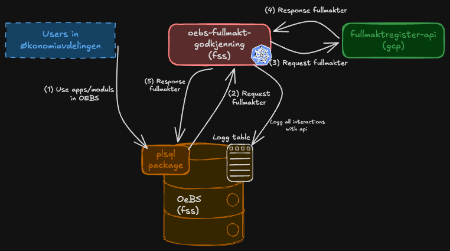

# oebs-fullmakt-godkjenning-api

REST API service that proxies the fullmaktregister-api, used by OEBS to request fullmakter from FSS (sikker sone).
The service exposes a REST endpoint that proxies requests to the fullmakt registry,
enabling querying of fullmakter based on segment, segmentverdi, and minimum amount.

---

## Architecture
  
The service acts as a proxy between OEBS and fullmaktsregister-api.
Incoming requests are logged to the database, then forwarded to the fullmakt registry with the appropriate query parameters and Authorization header.

---

## Functionality

OEBS needs to verify that its users have the required fullmakter to perform actions in OEBS. To accomplish this, OEBS must be able to query the fullmakt registry for the fullmakter associated with a given user.
Because the fullmakt registry API resides in GCP and OEBS requires all requests and responses to be logged in the OEBS database, this service was created as a proxy for the fullmakt registry API.
This is not an ideal setup and should be changed in the future so that OEBS calls the fullmakt registry directly.

### Security
Because the service runs in sikker sone (secure zone) and acts as a proxy, no authentication or authorization has been configured on the service itself.
However, requests to the API exposed by this service must include a bearer token from Azure AD. This token is intended for accessing the fullmakt registry API, not for accessing this service, and is therefore not validated here.
A valid token is still required in order to successfully reach the fullmakt registry, providing an indirect form of token validation.

### Endpoints

| Method | Path | Description |
|--------|------|-------------|
| `GET` | `/api/v1/fullmakt` | Retrieves fullmakter from the fullmakt registry |

**Query parameters for `GET /api/v1/fullmakt`:**

| Parameter | Required | Description |
|-----------|----------|-------------|
| `org_id` | No (default: `202`) | Organisation ID |
| `segmentverdi` | No | e.g. `159101` |
| `segment` | No | e.g. `Kostnadssted` |
| `minBelopsgrense` | No | e.g. `25000` |

**Headers:**
- `Authorization` – Required. Bearer token from Azure AD for accessing the fullmaktregister-api.

### Instances and OEBS environments

The service currently runs with three instances: t1, q1, and prod.

### OEBS PL/SQL procedures

OEBS is the sole consumer of this service, and requests to the API are sent via a package in OEBS.
- [Package specification](https://github.com/navikt/oebs/blob/OEBS-1561/admin/sql/XXRTV_FULLMAKT_API_PKG.pks)
- [Package body](https://github.com/navikt/oebs/blob/OEBS-1561/admin/sql/XXRTV_FULLMAKT_API_PKG.pkb)
- [Token AD package specification](https://github.com/navikt/oebs/blob/OEBS-1561/admin/sql/XXRTV_TOKEN_AD_PKG.pks)

---

## Dependencies

| System | Purpose                                                                   |
|--------|---------------------------------------------------------------------------|
| **Fullmakt registry** | External system providing fullmakt data; called via REST                  |
| **OEBS Oracle Database** | Stores request/response logs via `KallLogg` and requests API from package |
| **NAIS platform** | Container orchestration, secrets management, and deployment               |

---

## Running Locally

No local development setup has been configured for this service. During development, it is recommended to merge to main and deploy to t1, then [verify by sending a request to the t1 instance](#verify-after-deployment).

---

## Testing

Unit tests are set up using JUnit, Mockito, and WireMock.

- `FullmaktServiceTest` – tests HTTP forwarding, query parameters, and Authorization header handling using WireMock
- `ControllerTest` – tests request/response mapping using MockMvc with a mocked `FullmaktService`
- `HttpLoggingFilterTest` – tests that all requests and responses are correctly logged to the database

Run all tests with:
```bash
mvn verify
```

---

## Monitoring and Alerting

No alerting or monitoring is currently set up for this service.

---

## Deploy

### Branching strategy
- Feature development should happen on dedicated branches with a PR to `main`.
- Merging to `main` triggers deployment to **all environments** (T1, Q1, and production).

### Referencing Jira tasks
Include the Jira task key in the branch name and/or commit message. All PRs are squash-merged into main, so the most important thing is that the Jira issue is referenced in the squash commit message and that the PR title references the Jira issue. For example, if working on `OEBS-123`, the commit message should include `feat(OEBS-123): new rest endpoint` and the PR title should follow the same format. If a PR covers multiple Jira issues, all should be referenced, e.g. `feat(OEBS-123, OEBS-124): new rest endpoint and tests`. All individual commits should be listed in the PR description.

### Deployment pipeline
Deployments are handled by GitHub Actions.

### Promotion criteria
Before deploying to production:
- All tests must pass (`mvn verify`).
- SonarCloud analysis must not introduce new critical issues.


### Verify after deployment
After deployment, verify that the t1 instance is running and can successfully proxy requests to the fullmakt registry.
You can do this by sending a test request to the `/api/v1/fullmakt` endpoint with a valid bearer token and checking the response.
Credentials for this test request can be obtained from the following secret: [oebs-fullmakt-godkjenning-verify-deploy](https://console.nav.cloud.nais.io/team/team-oebs/dev-fss/secret/oebs-fullmakt-godkjenning-verify-deploy)
1. Send a request to the token URL with the body parameters `client_id`, `client_secret`, `scope`, and `grant_type` to obtain a bearer token.
2. Send a request to the request URL with the obtained bearer token in the Authorization header to verify that the service is working as expected.
3. The response should be a `200 OK` with a body containing the expected fullmakt data.

---

## Documentation

### Swagger / OpenAPI
Swagger UI is available when the application is running, however it is not fully functional. It can be used to view the API contract,
but sending requests via Swagger UI is not supported.

- [Swagger t1](https://oebs-fullmakt-godkjenning-api-t1.intern.dev.nav.no/swagger-ui/index.html)
- [Swagger q1](https://oebs-fullmakt-godkjenning-api-q1.intern.dev.nav.no/swagger-ui/index.html)
- [Swagger prod](https://oebs-fullmakt-godkjenning-api.intern.nav.no/swagger-ui/index.html)

### System documentation
No system documentation have been found for this service. 
